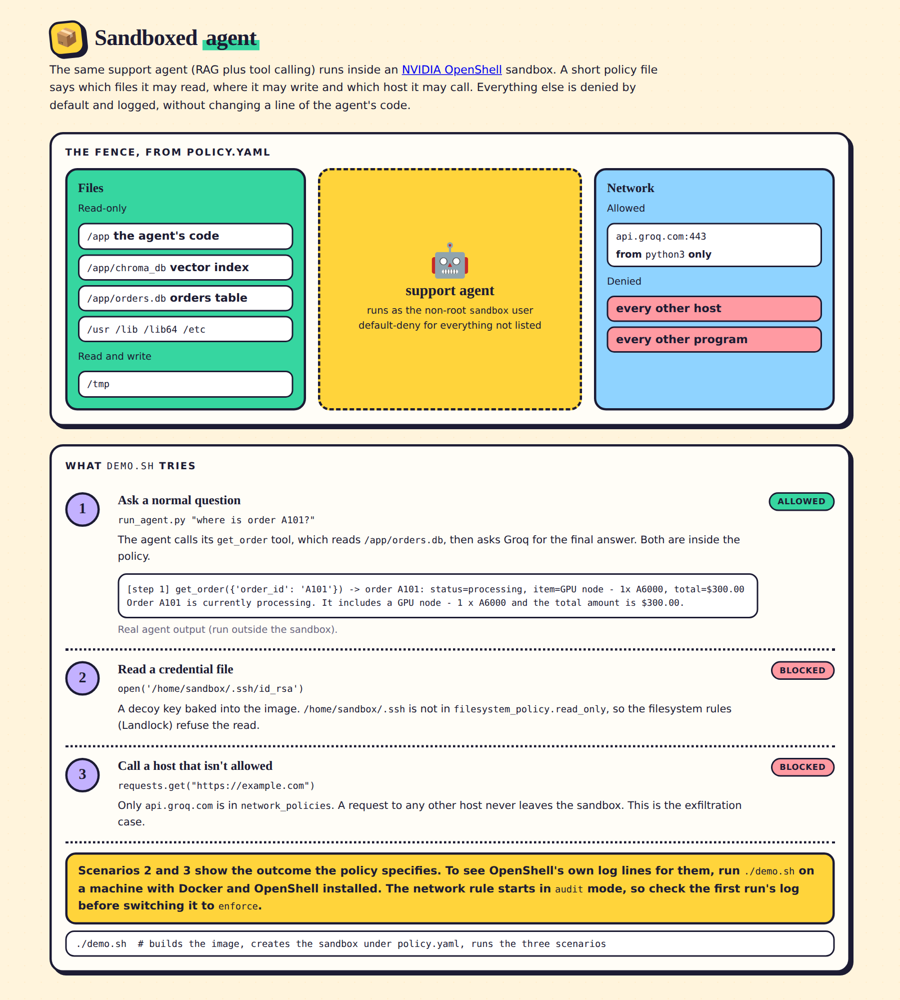

# sandboxed-agent

**Proves:** the same [support-agent](https://github.com/joel819/support-agent) (RAG + SQLite tool calling) can be dropped into an [NVIDIA OpenShell](https://github.com/NVIDIA/OpenShell) sandbox and, without changing a line of its code, be provably restricted to only the files and network destinations a policy file names — everything else, including credential theft and data exfiltration attempts, gets blocked at the OS level and logged.

This is a demo built on free tiers (Ollama/Groq free inference, OpenShell OSS). It is **not** running on NVIDIA Sentry or BlueField hardware — OpenShell software sandboxing only.

## Overview

[`docs/index.html`](docs/index.html) is a one-page picture of the policy and the three scenarios (open it in a browser, or serve `docs/` with GitHub Pages). Scenario 1 shows real agent output. Scenarios 2 and 3 show the outcome the policy specifies. `./demo.sh` produces OpenShell's own log lines for them.



## Quickstart (3 commands)

```bash
curl -LsSf https://raw.githubusercontent.com/NVIDIA/OpenShell/main/install.sh | sh
export GROQ_API_KEY=your_key_here   # optional - omit to run scenario 1 with a canned response
# export GROQ_MODEL=...             # optional - defaults to openai/gpt-oss-120b (Groq retires models over time)
./demo.sh
```

## What the agent prints

Scenario 1 with a Groq key. This run is the same `run_agent.py` call, executed on a normal machine (not inside OpenShell). The `[step]` line goes to stderr and shows the real tool call and result:

```text
$ python3 run_agent.py "where is order A101?"
  [step 1] get_order({'order_id': 'A101'}) -> order A101: status=processing, item=GPU node - 1x A6000, total=$300.00
Order A101 is currently processing. It includes a GPU node - 1 x A6000 and the total amount is $300.00.
```

## The policy, in plain English

[`policy.yaml`](policy.yaml) says, to the sandboxed container:

- **You may read** `/app` — the agent's own code, plus `chroma_db/` (the vector index) and `orders.db` (the orders table). That's everything `tools.py` actually touches.
- **You may write** only to `/tmp`.
- **You may make network calls** only to `api.groq.com`, and only from `python3` — nothing else, no other binary, no other host.
- **Everything else is denied by default.** OpenShell's sandbox policy is default-deny; the policy file is a narrow allow-list, not a blocklist.

The network rule starts in `enforcement: audit` rather than `enforce` — Groq's completions endpoint is a `POST`, and OpenShell's docs don't fully spell out whether the `full` access preset covers POST for REST endpoints. Audit mode logs the real decision without blocking it, so the log from a first run confirms the right setting before flipping to `enforce`. See [Network Rules](https://docs.nvidia.com/openshell/how-it-works/policies/network-rules).

## What `demo.sh` shows

| # | Attempt | Expected outcome |
|---|---|---|
| 1 | `run_agent.py "where is order A101?"` — a real tool call against `orders.db` | **Allowed** — within policy |
| 2 | Read `~/.ssh/id_rsa` (a decoy key baked into the image, not a real one) | **Blocked** — not in `filesystem_policy.read_only` |
| 3 | `requests.get("https://example.com")` from inside the sandbox | **Blocked** — not `api.groq.com` |

Each scenario prints what was attempted, the allow/deny verdict, and the actual `openshell logs` line OpenShell produced for it.

## How the pieces fit

- `agent.py`, `tools.py`, `setup_data.py` — copied **unmodified** from the original support-agent.
- `groq_adapter.py` — a new file giving `agent.call_model()` a Groq-shaped twin (Groq's API is OpenAI-compatible; Ollama's local API isn't reachable from inside the sandbox's network namespace, and isn't on the policy's allow-list anyway).
- `run_agent.py` — the demo entrypoint. Monkey-patches `agent.call_model` to the Groq adapter when `GROQ_API_KEY` is set; otherwise replays a canned trace so the demo still runs with zero setup.
- `Dockerfile` — dependencies (`chromadb`, `requests`) are installed at image build time, with normal unrestricted network access. OpenShell's policy only governs the *running* sandbox — there's no PyPI in the allow-list, so runtime `pip install` would fail by design.

## Tests

`pip install pytest requests && pytest tests` checks the history translation in `groq_adapter.py` offline (no key, no network, no OpenShell).

## Sources

- [NVIDIA/OpenShell](https://github.com/NVIDIA/OpenShell)
- [Policy Schema Reference](https://docs.nvidia.com/openshell/how-it-works/policies/schema)
- [Network Rules](https://docs.nvidia.com/openshell/how-it-works/policies/network-rules)
- [Accessing Logs](https://docs.nvidia.com/openshell/observability/accessing-logs)
- [Sandbox Policy Quickstart example](https://github.com/NVIDIA/OpenShell/tree/main/examples/sandbox-policy-quickstart)
